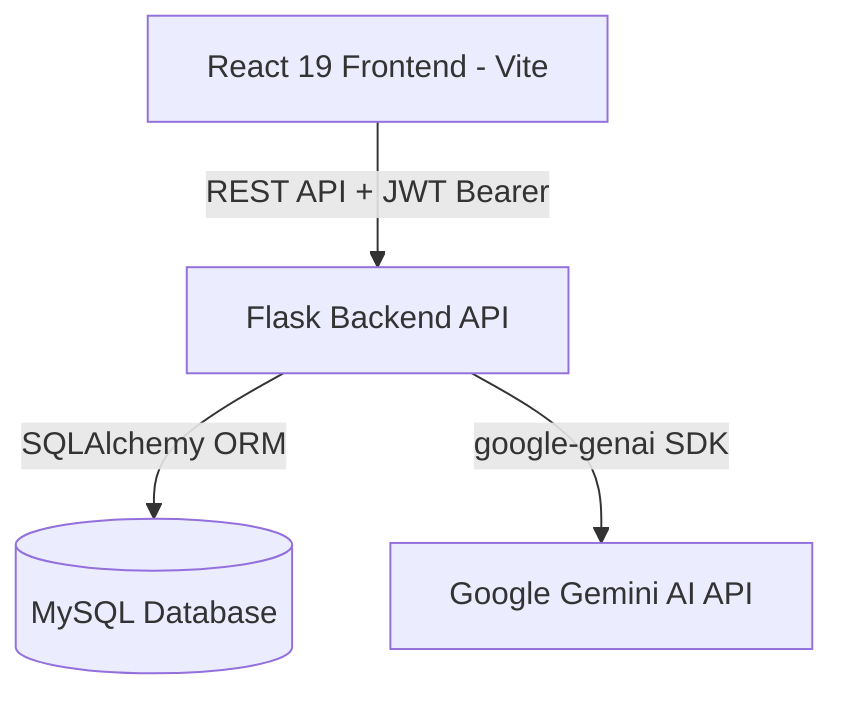

# Architecture Overview — Notely

This document outlines the technical architecture, data flows, and system patterns of the Notely application.

---

## 1. System Topology

Notely is built as a split-architecture Web Application:

---

## 2. Frontend Architecture
* **Framework**: React 19 built with Vite.
* **Styling**: Tailwind CSS v4.
* **Routing**: React Router v7 client-side routing.
* **State Management**:
  * **Global Session State**: Zustand stores [`authStore.js`](file:///Users/prajwal/Downloads/Noteapp/frontend/src/store/authStore.js) (JWT tokens, user sessions) and [`uiStore.js`](file:///Users/prajwal/Downloads/Noteapp/frontend/src/store/uiStore.js) (toasts, UI themes).
  * **Server Cache State**: TanStack React Query for managing API fetch states.
* **HTTP Client**: Axios configured with token headers in [`client.js`](file:///Users/prajwal/Downloads/Noteapp/frontend/src/api/client.js).

---

## 3. Backend Architecture
* **Framework**: Flask development API server.
* **Security & Tokens**: JWT tokens generated via `Flask-JWT-Extended` using SHA-256 signatures. Identity checks occur at `user_lookup_loader` hooks in `__init__.py`.
* **Database Access**: SQLAlchemy ORM for relational queries.
* **Rate Limiting**: `Flask-Limiter` limits requests based on IP.
* **CORS**: Configured in `__init__.py` to allow cross-origin requests from the client.

---

## 4. AI & Retrieval-Augmented Generation (RAG) Flow
Notely uses semantic matching to power its AI Companion:

1. **Note Modification**: When a note is saved, the backend triggers an asynchronous embedding request.
2. **Embedding Creation**: The text content is vectorized using Google Gemini's `text-embedding-004` model (768 dimensions).
3. **Storage**: The vector is saved in the `note_embeddings` database table as a JSON array of floats.
4. **AI Chat Query**:
   * The user asks a question via the chat side panel.
   * The backend generates an embedding of the query.
   * A cosine-similarity search query runs against `note_embeddings` to find the top $N$ relevant notes.
   * The text from the closest matching notes is injected into the Gemini `gemini-1.5-flash` generation context as references.
   * Gemini compiles the final response and returns it to the client with the cited note IDs.
