# Notely

Notes app with an AI companion that answers questions from your own notes and maps how they connect.

Built with React, Flask, and MySQL — Notely isn't just a place to store notes, it's a notes app that
actually helps you find and connect what you've already written, instead of leaving you to search
through it yourself.

## Features

- **AI Companion** — ask a question and get an answer pulled from your own notes, with a link back to
  the exact note it came from.
- **Knowledge Map** — notes that are related get connected automatically, so old ideas resurface when
  they're relevant again.
- **Folders & tags** — organize notes manually, or let AI suggest tags and apply them for you.
- **AI writing tools** — summarize, improve, and tag your notes in one click.
- **Google Sign-In** — log in or create an account with Google, or with email and password.

## Tech stack

**Frontend**: React 19, Vite, Tailwind CSS v4, React Router v7, Zustand, TanStack React Query, Axios  
**Backend**: Flask, Flask-SQLAlchemy, Flask-Migrate (Alembic), Flask-JWT-Extended, Flask-Limiter, Flask-CORS  
**Database**: MySQL  
**AI**: Google Gemini (`google-genai`)

## Getting started

### Prerequisites
- Python 3.11+
- Node.js 18+
- A running MySQL server
- A Google Gemini API key
- (Optional) A Google OAuth client ID, for Google Sign-In

### Backend setup

```bash
cd backend
python -m venv venv
source venv/bin/activate   # Windows: venv\Scripts\activate
pip install -r requirements.txt
cp .env.example .env       # then fill in the values below
flask db upgrade
flask run
```

### Frontend setup

```bash
cd frontend
npm install
cp .env.example .env       # set VITE_API_BASE_URL to your backend URL
npm run dev
```

### Environment variables (backend `.env`)

```env
FLASK_ENV=development
SECRET_KEY=
JWT_SECRET_KEY=

DB_HOST=localhost
DB_PORT=3306
DB_USER=
DB_PASSWORD=
DB_NAME=

GEMINI_API_KEY=
GOOGLE_CLIENT_ID=

RATE_LIMIT_DEFAULT=100/hour
```

The app will refuse to start if any of these are missing — there are no placeholder fallback values.

## Project status

Actively in development. See [Issues](../../issues) for known bugs and planned work.

## License

Proprietary Software. All rights reserved. See the [LICENSE](LICENSE) file for terms.

## Product Walkthrough

Here is a visual walkthrough of the Notely application:

### Marketing Pages

#### Homepage
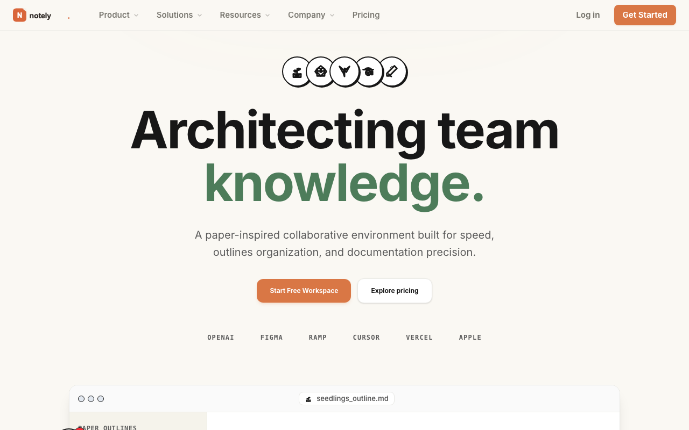
*The landing page highlighting Notely's core features and values.*

#### Product
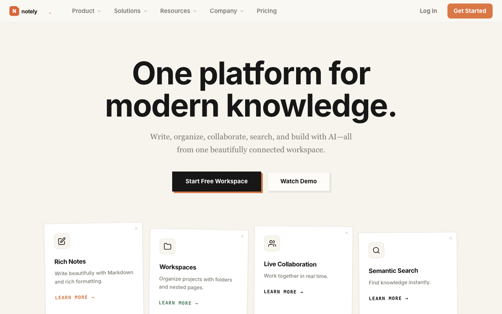
*Detailed breakdown of Notely features, including folders, tags, and AI writing helper.*

#### Solutions
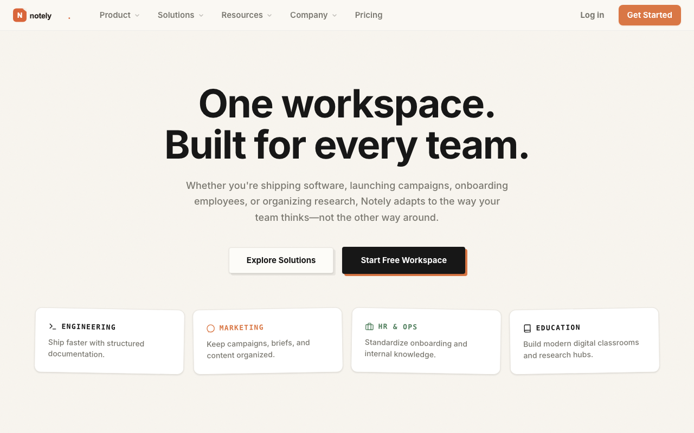
*Use-cases for Notely, tailored to different roles and workflows.*

#### Pricing
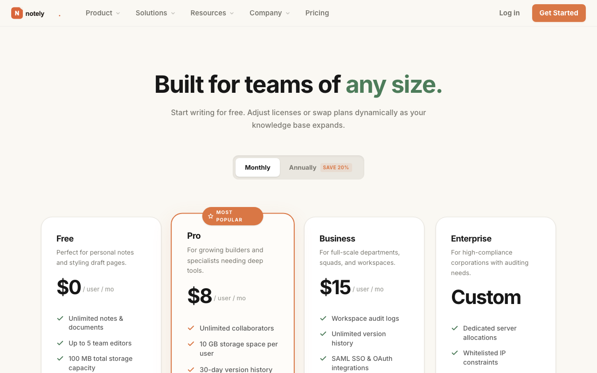
*Flexible plans available for users, ranging from free tiers to business options.*

#### Sign Up
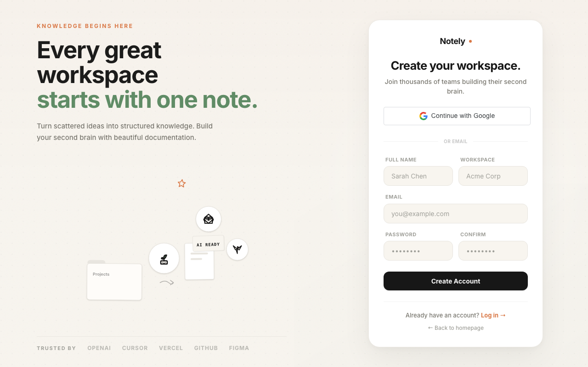
*The workspace creation page for registering new accounts.*

#### Log In
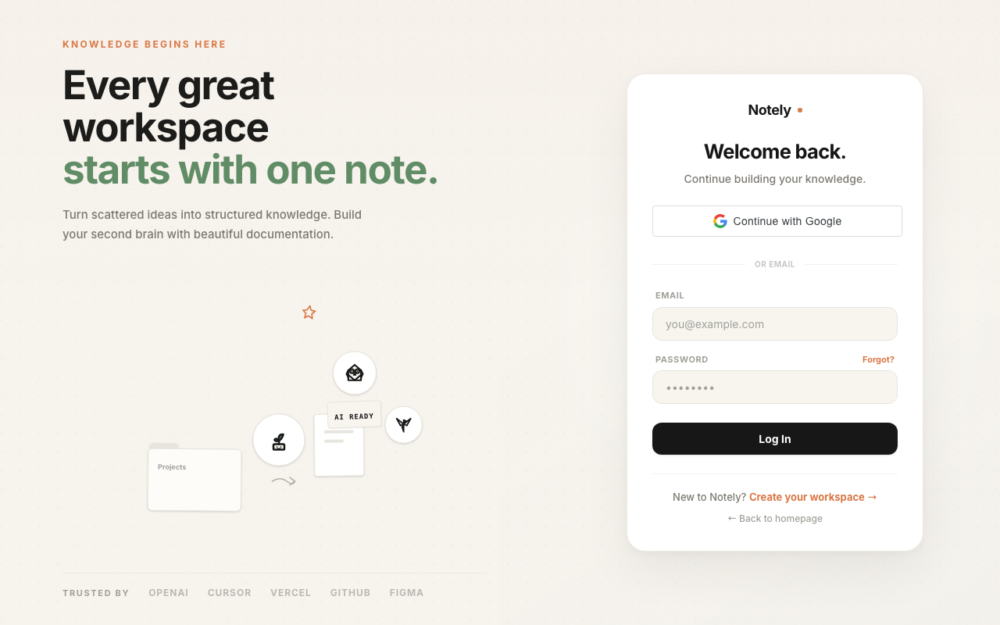
*Secure email and password entry with option for Google sign-in.*

### Application Dashboard & AI Features

#### Empty Dashboard
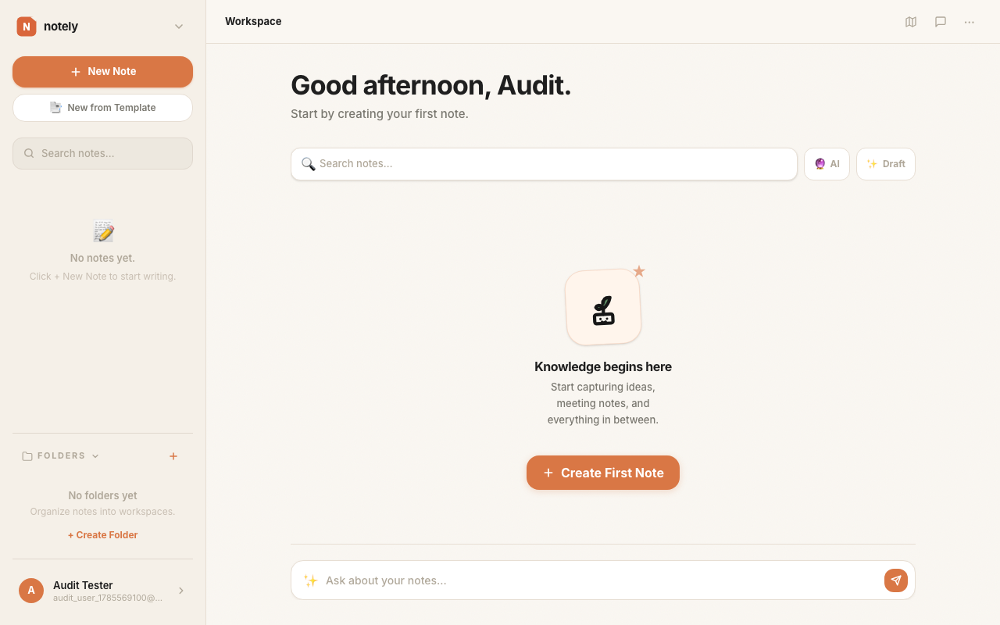
*The initial clean-slate workspace shown to new users before any notes are created.*

#### Notes Board (Active Editor)
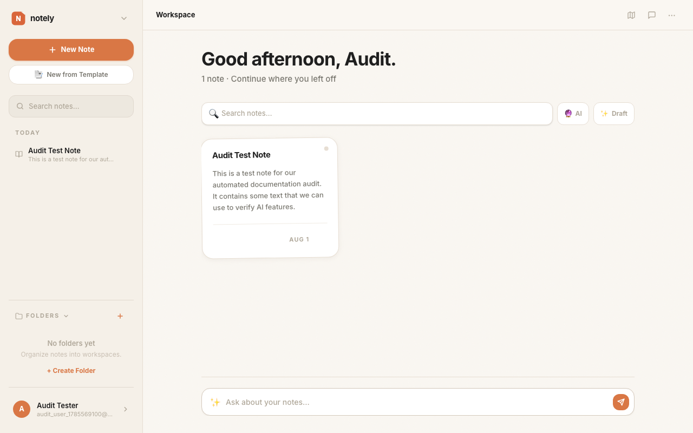
*The workspace dashboard showing the main note editor and note list.*

#### AI Companion
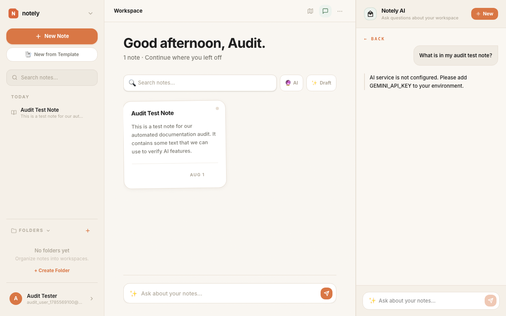
*The interactive side drawer where users can query their notes using natural language.*

#### Knowledge Map
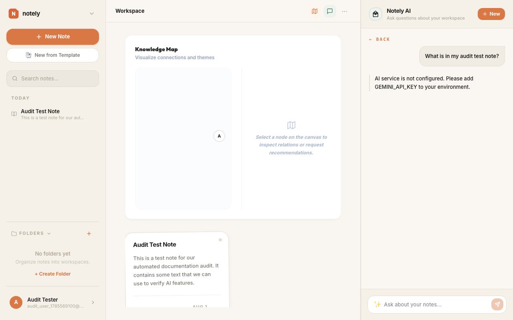
*An interactive graph view showing automatically connected note nodes.*

#### Settings: Profile
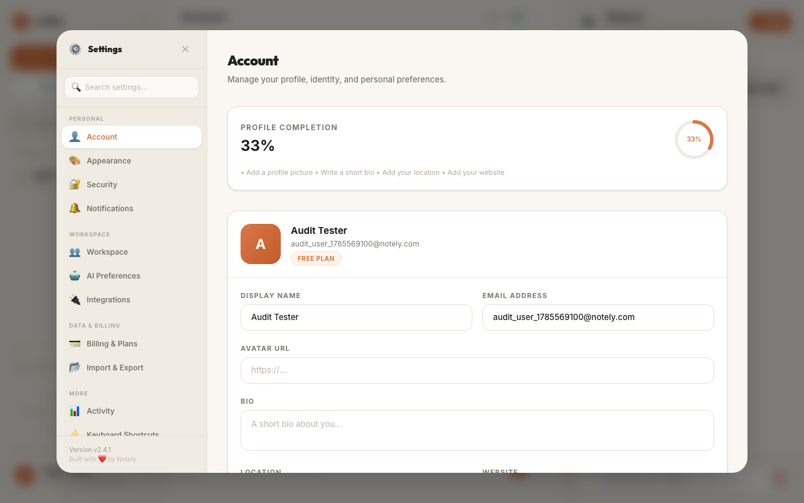
*User profile settings modal showing details, timezone, and preferences.*

#### Settings: Billing & Plans
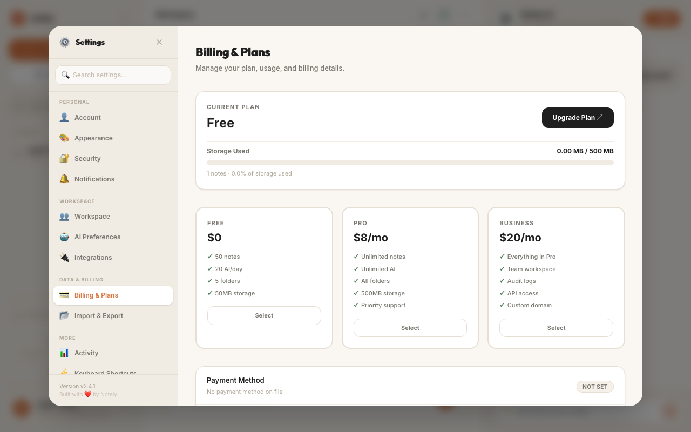
*Plan configuration tab demonstrating premium quotas and feature limits.*
